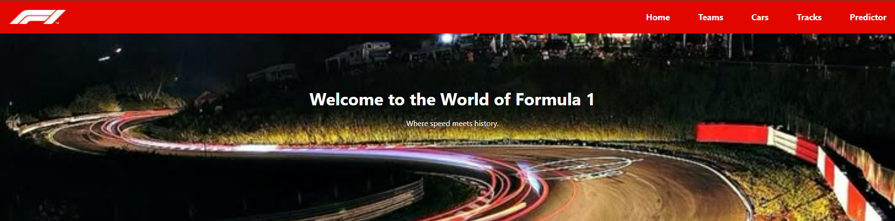
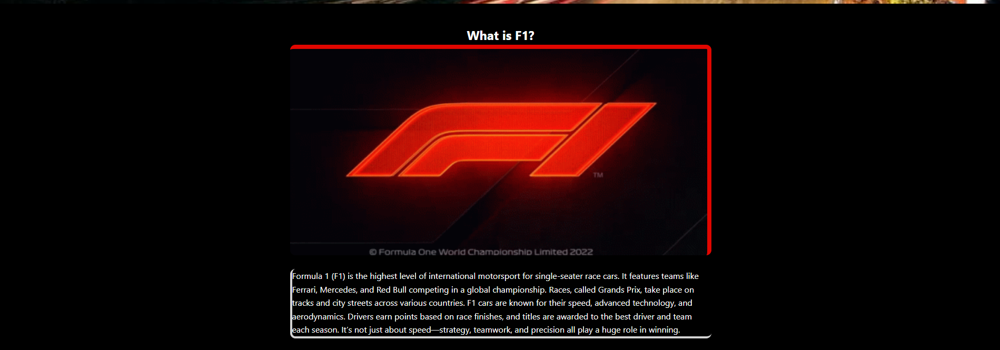
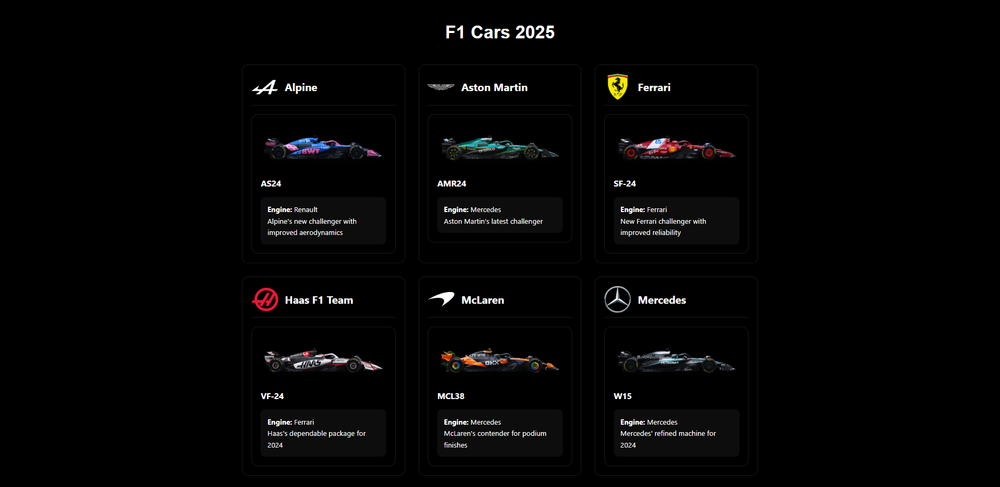
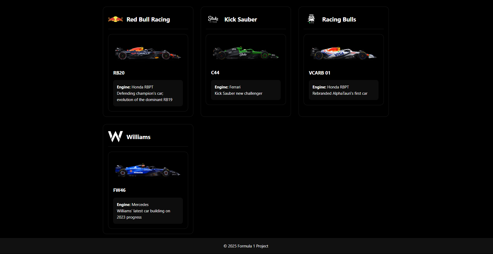
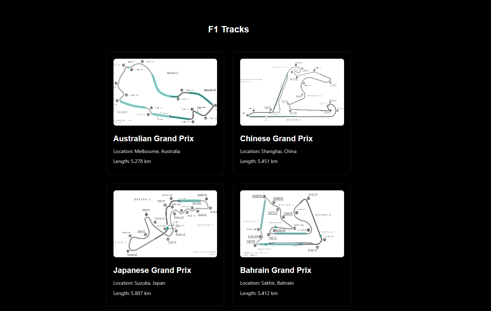
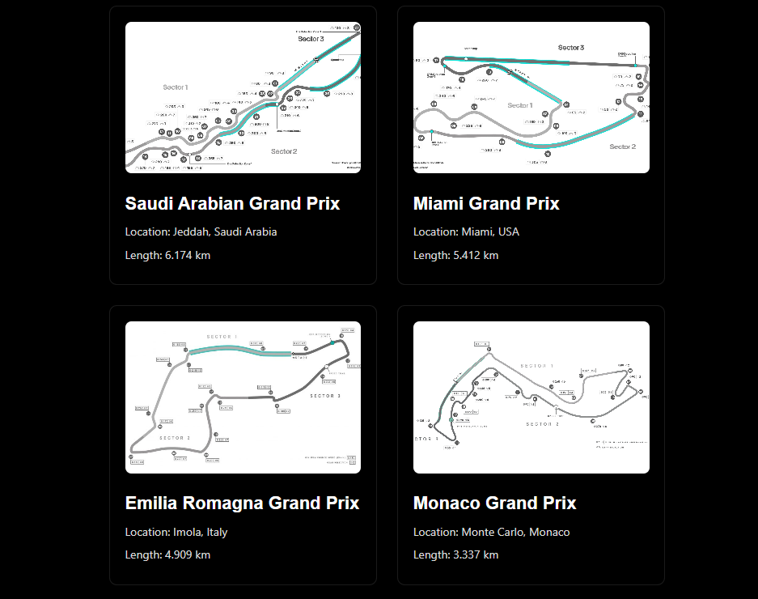
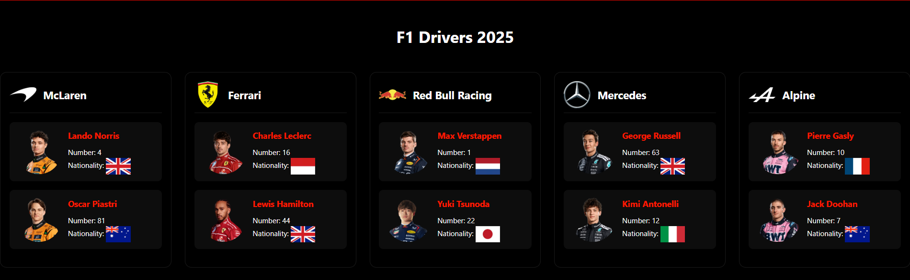
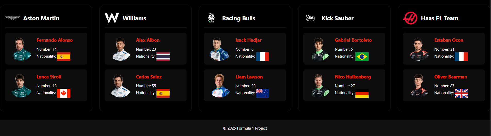
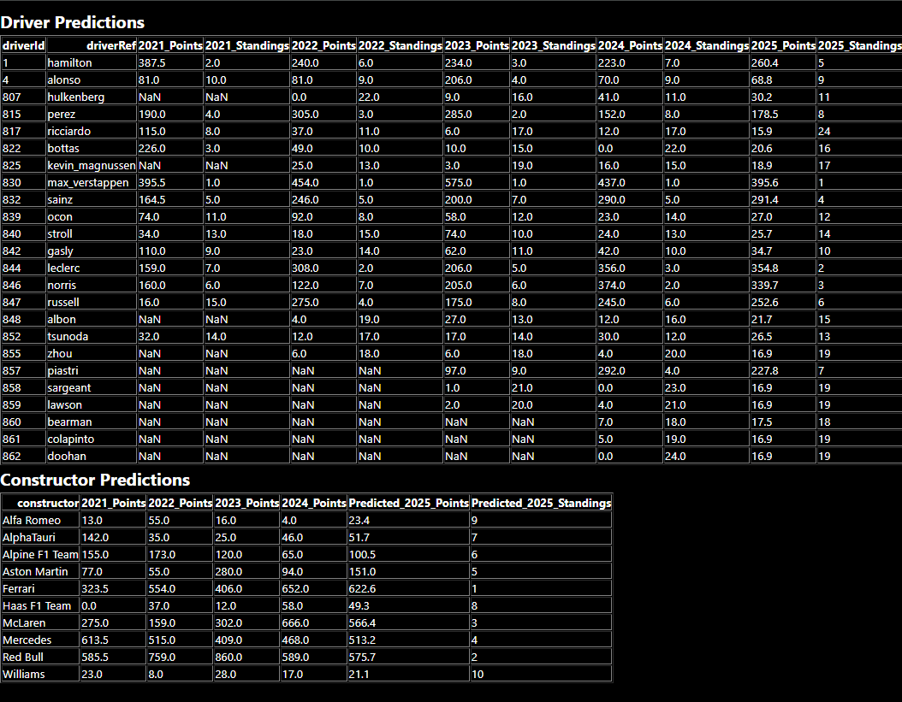

# 🏎️ Formula One Team Performance Predictor

**Formula One Team Performance Predictor** is a machine learning project focused on forecasting Formula 1 race results and constructor standings.

By analyzing historical race data, driver performance, and circuit characteristics from the 2021–2024 seasons, the project predicts future race outcomes and overall team performance trends.  
Our goal is to combine real-world motorsport data with powerful ML models to generate accurate insights for the 2025 Formula 1 season.

---

## 🚀 Tech Stack

- **Python** (Pandas, NumPy, PyTorch)
- **Apache Spark (PySpark)**
- **Microsoft Azure** (Virtual Machines)
- **Matplotlib & Seaborn** (Visualizations)
- **Jupyter Notebooks**

---

## 📁 Project Structure

```
Formula1-Predictor/
│
├── data/
│   ├── historical_results.csv
│   └── track_characteristics.csv
│
├── notebooks/
│   ├── data_cleaning.ipynb
│   ├── model_training.ipynb
│   └── prediction_engine.ipynb
│
├── scripts/
│   └── spark_dijkstra.py
│
├── screenshots/
│   ├── homepage-preview.png
│   ├── drivers-preview.png
│   ├── constructors-preview.png
│   ├── cars-preview.png
│   └── tracks-preview.png
│
├── main.py
├── requirements.txt
└── README.md
```

---

## 📊 Output Predictions for 2025

### 🏁 Homepage
  


### 🚗 Cars
  


### 🛣️ Tracks
  


### 🧠 Driver Performance Table


### 🧑‍🚀 2025 F1 Drivers Overview
  


### 🏢 Constructor Predictions


### 🗓️ F1 Calendar & Model Output
  


---

## ⚙️ How to Run

Clone the repository and install dependencies:

```bash
git clone https://github.com/yourusername/Formula1-Predictor.git
cd Formula1-Predictor
pip install -r requirements.txt
```

Run notebooks for preprocessing, training, and prediction:

```bash
# Inside Jupyter or VS Code
notebooks/data_cleaning.ipynb
notebooks/model_training.ipynb
notebooks/prediction_engine.ipynb
```

Deploy or test in your Azure Virtual Machine if needed.

---

## 👤 Author

**Muhammad Nadeem**  
📍 Atlanta, GA  
🔗 [Portfolio Website](https://harris1250.github.io/muhammad-portfolio)  
🐙 [GitHub](https://github.com/Harris1250)  
🔗 [LinkedIn](https://www.linkedin.com/in/muhammad-nadeem-977683251)

---

## 📌 Acknowledgments

Data sources include official Formula 1 datasets and public racing archives.  
This project was built independently by Muhammad Nadeem as part of a college Cloud Computing course.

---

## 🧠 Future Improvements

- Add a live dashboard using Streamlit or Flask  
- Implement real-time race prediction API  
- Visualize season-wide team performance with trendlines and bar graphs

---
